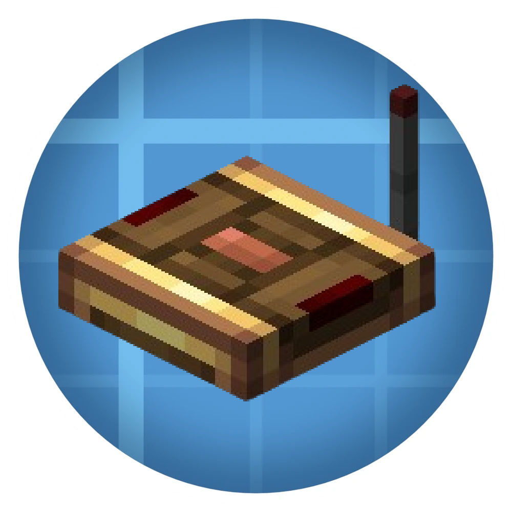

  

# **Create: Frequency**

**A powerful wireless utility for the Create mod.**

---

### **Overview**
**Create: Frequency** is an addon for [Create](https://github.com/Creators-of-Create/Create) that adds a wireless communication system based on frequencies. It allows for seamless remote interaction and organized network management across your entire world.

This is a community port of [ripiters](https://github.com/ripiters)' original [Create: Frequency for NeoForge 1.21.1](https://github.com/ripiters/Create-Frequency-1.21.1), backported to **Forge 1.20.1** by **Itsjustrey**. A huge thank you to ripiters for the original mod and for making the source available under the MIT License — this port would not exist without their work.

### **Requirements**
To ensure compatibility, please use the following versions:

* **Minecraft:** `1.20.1`
* **Forge:** `47.4.10` or higher
* **Create:** `6.0.8` or higher

---

### **Resources**
* 📦 **Modrinth:** [Project Page](https://modrinth.com/project/create-frequency)
* 🔥 **Curseforge:** [Project Page](https://legacy.curseforge.com/minecraft/mc-mods/create-frequency)
* 🛠️ **Issue Tracker:** [Report a Bug](https://github.com/ripiters/Create-Frequency-1.21.1/issues)
* 📜 **License:** [MIT](./LICENSE)

---

### **License**

Original work Copyright (c) 2026 [ripiters](https://github.com/ripiters)  
Forge 1.20.1 port Copyright (c) 2026 Itsjustrey

This project is licensed under the **MIT License** — you are free to use, copy, modify, merge, publish, distribute, sublicense, and/or sell copies of this software, provided that the original copyright notice and this permission notice are included in all copies or substantial portions of the software.

See the [LICENSE](./LICENSE) file for the full license text.

---

  Built with passion for the Create Mod community.

